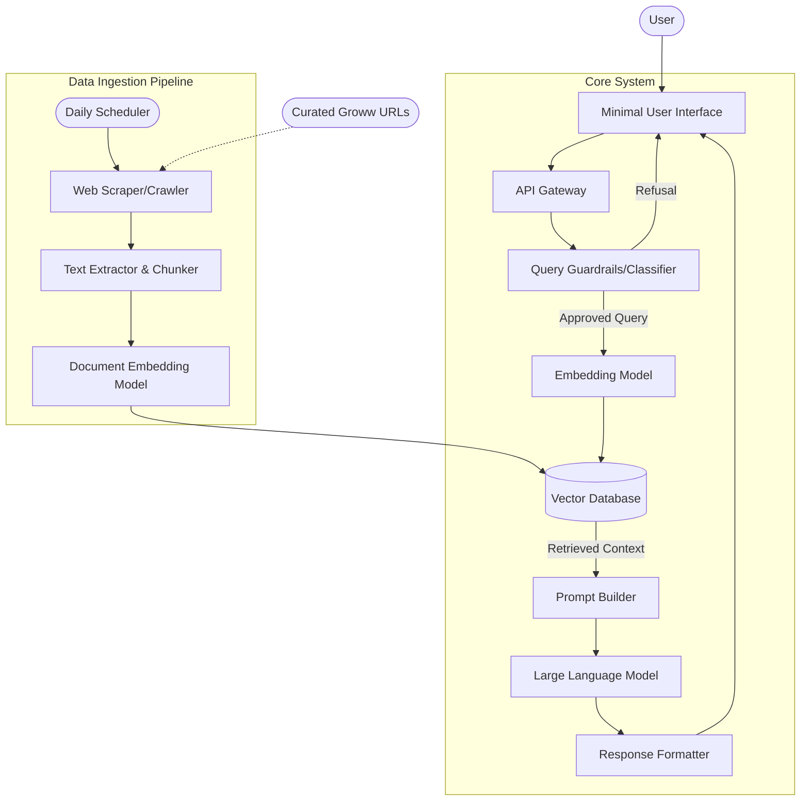

# Architecture Document: Mutual Fund FAQ Assistant

## 1. System Overview
The Mutual Fund FAQ Assistant is a lightweight Retrieval-Augmented Generation (RAG) system designed to answer objective, factual queries about mutual funds. It prioritizes accuracy, transparency, and compliance over conversational flexibility, strictly avoiding investment advice and relying solely on a curated set of verified URLs.

## 2. High-Level Architecture Diagram

## 3. Data Ingestion Pipeline
The data ingestion pipeline is responsible for gathering and processing the raw text from the curated source URLs into a format suitable for semantic search. This pipeline is triggered automatically on a daily schedule to ensure data freshness.

1.  **Daily Scheduler**: A cron job or scheduled task triggers the ingestion process once every 24 hours.
2.  **Source Crawling**: The system fetches content strictly from the 5 predefined ICICI Prudential fund URLs on Groww.
3.  **Extraction & Parsing**: Relevant sections (e.g., Expense ratio, Exit load, Minimum SIP, Fund management data) are extracted and cleaned of HTML/unnecessary boilerplate.
4.  **Chunking**: The cleaned text is split into smaller, meaningful chunks to preserve context during retrieval.
5.  **Embedding**: Text chunks are converted into dense vector embeddings using a text embedding model.
6.  **Vector Storage**: The embeddings, along with their metadata (source URL and extraction date), are stored in a Vector Database for fast similarity search.

## 4. Query Execution Flow (RAG)
When a user submits a query, the system follows this execution path:

1.  **Input Guardrails**: The query is evaluated to determine if it is seeking investment advice or subjective opinions (e.g., "Which fund is better?"). If so, the query is rejected with a predefined polite refusal and an educational link.
2.  **Semantic Search**: If approved, the query is converted into an embedding and compared against the Vector Database to find the most relevant chunks of text from the ingested documents.
3.  **Prompt Construction**: The retrieved chunks are combined with the user's query and a strict system prompt. The system prompt enforces the 3-sentence limit, the inclusion of a citation link, and the facts-only constraint.
4.  **LLM Generation**: The Language Model generates a response based *only* on the provided context chunks.
5.  **Output Formatting**: The response is verified and formatted to ensure the citation link and the required footer (`"Last updated from sources: <date>"`) are present.

## 5. Core Components
*   **Minimal UI**: A clean interface featuring a welcome message, 3 example queries, a prominent disclaimer ("Facts-only. No investment advice."), and the chat interface.
*   **Classifier / Guardrails**: A lightweight intent classification module (or specialized LLM prompt) that intercepts non-factual, advisory, or out-of-scope queries.
*   **Vector Database**: A fast, scalable storage solution for vector embeddings and document metadata (e.g., ChromaDB, Pinecone, or FAISS).
*   **LLM Engine**: A capable foundation model tasked exclusively with synthesizing retrieved facts and summarizing them concisely.

## 6. Refusal & Compliance Guardrails
To ensure strict adherence to the facts-only requirement:
*   **Advisory Queries**: Any query asking for opinions, comparisons, or predictions is immediately flagged and handled via a static refusal template.
*   **Hallucination Prevention**: The prompt strictly instructs the LLM to reply with "I cannot find this information in the provided documents" if the retrieved context does not contain the answer.

## 7. Privacy & Security Measures
*   **Zero PII Collection**: The system does not request, log, or process any Personally Identifiable Information (PAN, Aadhaar, Account numbers, OTPs, etc.).
*   **Stateless Interactions**: Each query is processed independently without storing session history that could inadvertently capture sensitive user data.

## 8. Proposed Technology Stack
*   **Frontend**: React / Next.js (or simple HTML/JS for minimal scope)
*   **Backend**: Python (FastAPI / Flask)
*   **RAG Orchestration**: LangChain or LlamaIndex
*   **Vector Database**: ChromaDB (for local/lightweight setup) or Pinecone/Weaviate
*   **LLM / Embeddings**: Open-source models (e.g., `BAAI/bge-large-en-v1.5` for embeddings, Llama 3 via Ollama for generation) or OpenAI API (GPT-3.5/4)
